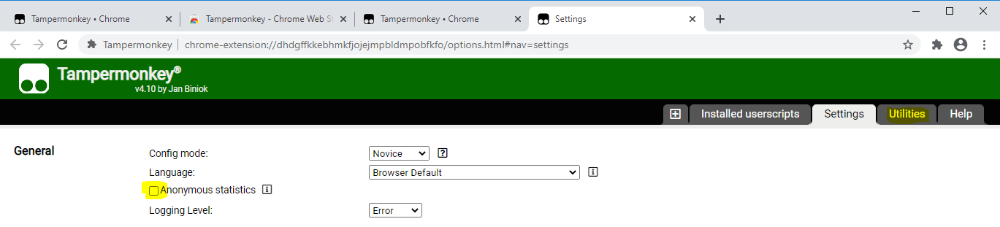
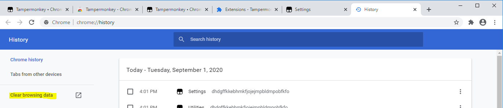

## Installation instructions for Chrome

*Example shown using Windows, but things will be essentially identical on other operating systems.*

1. Open Chrome. Update Chrome to the latest version, if necessary.

2. In the main URL bar, type in `www.tampermonkey.net` and hit Enter/Return on the keyboard. This will open the Tampermonkey website. Click **Download** for Tampermonkey Stable.

3. Click **Add to Chrome**.

4. Click **Add Extension**.

5. Click the puzzle piece near the top right, then the three dots next to Tampermonkey, then **Options**.

6. If you don't want to send anonymous usage statistics to Tampermonkey, unckeck the box. Then click **Utilities** in the top right.

7. Click in the box labeled **Install from URL**. Type in:

`https://raw.githubusercontent.com/addDetails/addDetails/master/addDetails.js`

and then click **Install**. If you get an error, check for typos (note addDetails/addDetails).

8. Click **Install** on the next page that appears.

9. Clear your browser history. First, click on the three dots (the Chrome menu button) in the top right hand corner of the screen, and then click **History** and **History** again.

10. Click **Clear Browsing Data**.

11. Click **Clear Data**

12. Close Chrome.

