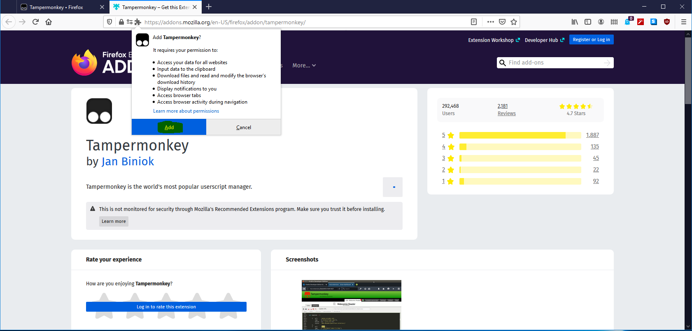
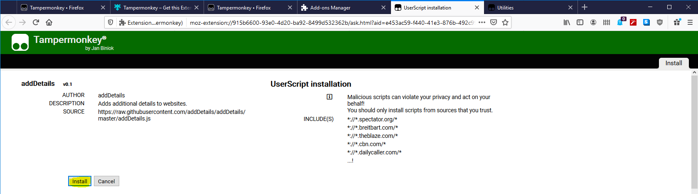

## Installation instructions for Firefox

*Example shown using Windows, but things will be essentially identical on other operating systems.*

1. Open Firefox. Update Firefox to the latest version, if necessary.

2. Click the menu button in the top right corner of the browser window, and then click **New Private Window**.

3. In the main URL bar, type in `www.tampermonkey.net` and hit Enter/Return on the keyboard. This will open the Tampermonkey website. Click **Download** (not the BETA version).

4. Click **Add to Firefox**.

5. Click **Add**.

6. Check the box labeled "**Allow this extension to run in Private Windows**" and then click "**Okay, Got it**."

7. Click the menu button in the top right again, then click **Add-ons**.

8. Click on the three dots next to Tampermonkey and then click **Options**.

9. Click on the **Utilities** tab in the top right.

10. Click in the box labeled **Install from URL**. Type in:

`https://raw.githubusercontent.com/addDetails/addDetails/master/addDetails.js`

and then click **Install**. If you get an error, check for typos (note addDetails/addDetails).

11. Click **Install** on the next page that appears.

12. If the Tampermonkey icon appears in your menu bar, right click on it, and then click **Remove from Toolbar**.

13. If you weren't using private browsing or you just want to be safe, clear your browser history. First, click on the Firefox menu button in the top right hand corner of the screen, and then click **Library**.

14. Click **History**.

15. Click **Clear Recent History...**

16. Click **OK**.

17. Close Firefox.

